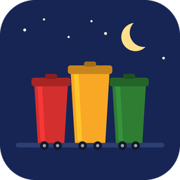
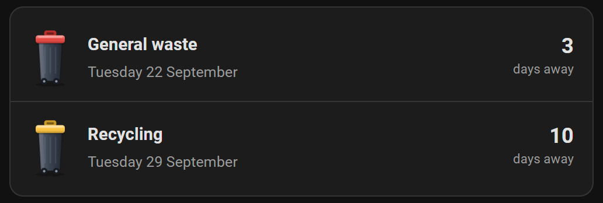

# Aussie Bin Night

A custom [Home Assistant](https://www.home-assistant.io/) integration that lets you pick your home address anywhere in Australia and shows you when your next kerbside household bin collection is — general waste, recycling, and green waste/FOGO, depending on what your local council collects.

Distributed via [HACS](https://hacs.xyz/) as a custom repository.

---

## ✨ Features

- 📍 **Address-based setup** — search and select your suburb/street during the config flow, no manual API keys or council codes required
- 🗓️ **Next collection sensor(s)** — one sensor per bin type (e.g. `sensor.bin_general`, `sensor.bin_recycling`, `sensor.bin_garden`)
- 🔔 **Automation-friendly** — trigger notifications the night before collection day
- 🖼️ **Lovelace card support** — optional companion card showing a friendly bin-icon countdown
- 🔁 **Stays current** — refreshes your schedule from Bin Night Tonight weekly, and once more shortly before each reminder, so a holiday-shifted collection is picked up before you are reminded



---

## 📦 Installation

Requires Home Assistant **2024.11** or newer.

### Via HACS (recommended)

1. Open **HACS** in Home Assistant
2. Go to **Integrations** → **⋮ (top right)** → **Custom repositories**
3. Add this repository URL and select category **Integration**
4. Search for **"Aussie Bin Night"** in HACS and click **Download**
5. Restart Home Assistant
6. Go to **Settings → Devices & Services → Add Integration** and search for **Aussie Bin Night**

### Manual installation

1. Copy the `custom_components/aussie_bin_night` folder from this repo into your Home Assistant `config/custom_components/` directory
2. Restart Home Assistant
3. Add the integration via **Settings → Devices & Services → Add Integration**

---

## ⚙️ Configuration

Configuration is done entirely through the UI (config flow) — no YAML required.

1. **Settings → Devices & Services → Add Integration → Aussie Bin Night**
2. Start typing your home address
3. Select your address from the autocomplete results
4. Confirm your council/LGA is detected correctly
5. Choose which bin types you want sensors for (some councils only offer a subset)
6. Done — sensors will appear under the integration's device page

Moved house, or picked the wrong address? Go to **Settings → Devices & Services → Aussie Bin Night → ⋮ → Reconfigure** to search for a new address without removing and re-adding the integration.

You can add the integration more than once, for example for a second property. Each address becomes its own device. The first household's sensors are named `sensor.bin_general`, `sensor.bin_recycling` and so on; a second household's get Home Assistant's numeric suffix (`sensor.bin_general_2`). The card lists every household's bins together, so set its `entities` list if you want just one.

### Options

After setup, you can adjust via **Configure**:

| Option             | Description                                                       | Default       |
| ------------------ | ----------------------------------------------------------------- | ------------- |
| Update interval    | Days between schedule refreshes (1–30)                            | 7 (weekly)    |
| Reminder lead time | Hours before the collection date that `reminder_time` should fall | 12            |
| Bin types shown    | Which bin sensors to create; deselecting one removes its sensor   | All available |

Beyond the regular refresh, the integration schedules extra ones at two points: shortly before each `reminder_time`, so an automation firing on it sees up-to-date data even if a public holiday moved the collection since the last poll; and the day after the last collection in the current schedule, so sensors don't sit on `unknown` waiting for the next poll.

If a refresh fails because of a connection problem or rate limiting, the sensors keep showing the last known dates (those are still valid) and the integration tries again in an hour.

---

## 🧩 Entities Created

| Entity                 | Description                                                 |
| ---------------------- | ----------------------------------------------------------- |
| `sensor.bin_general`   | Date of next general waste collection                       |
| `sensor.bin_recycling` | Date of next recycling collection                           |
| `sensor.bin_garden`    | Date of next green waste/FOGO collection (where applicable) |
| `sensor.bin_glass`, `sensor.bin_hard`, `sensor.bin_fogo` | Glass, hard-waste and food-and-garden-organics collections, where your council offers them |

Each sensor exposes attributes:

- `days_until` — number of days until next collection; recalculated at local midnight each day, without contacting the provider
- `collection_date` — ISO date of next collection
- `reminder_time` — timestamp, the configured reminder lead time before the start of `collection_date`; use it in a template trigger (see [Example Automation](#-example-automation))
- `following_collection_date` — ISO date of the collection after this one, when the schedule includes it
- `council` — detected council/LGA name, e.g. "Sample City Council"
- `council_id` — the provider's raw LGA identifier, e.g. `sample-city-council`
- `bin_type` — the provider's raw stream name, e.g. `general`
- `bin_colour` — lid colour, if known (useful for card icons)

One sensor is created for every bin stream Bin Night Tonight returns for your address, so you only see the ones your council actually collects. If a new stream appears later (for example an occasional hard-waste collection), its sensor is added automatically; streams you deselected in **Configure** stay off.

Sensors go `unavailable` only when the provider returns a response this integration doesn't understand. A temporary connection problem or rate limit does not make them unavailable: they keep the last known dates and the integration retries in an hour. If a stream has no upcoming collection, its sensor reports `unknown`; if the provider returns no collections at all for your address, a repair issue is raised under **Settings → Repairs** — see [Troubleshooting](#-troubleshooting).


---

## 🔔 Example Automation

A simple evening reminder, sent at 6 pm when general waste is collected tomorrow:

```yaml
automation:
  - alias: "Bin night reminder"
    triggers:
      - trigger: time
        at: "18:00:00"
    conditions:
      - condition: template
        value_template: "{{ state_attr('sensor.bin_general', 'days_until') == 1 }}"
    actions:
      - action: notify.mobile_app_your_phone
        data:
          title: "🗑️ Put the bins out!"
          message: "General waste collection is tomorrow morning."
```

Or, to fire exactly at the configured reminder lead time instead of at a fixed clock time:

```yaml
automation:
  - alias: "Bin night reminder (precise)"
    triggers:
      - trigger: template
        value_template: >
          
          {{ reminder is not none and now() >= (reminder | as_datetime) }}
    actions:
      - action: notify.mobile_app_your_phone
        data:
          title: "🗑️ Put the bins out!"
          message: "General waste collection is coming up."
```

A day-count trigger such as `numeric_state` on `days_until` fires at **midnight**, when the count changes, so a "night before" reminder is better done with one of the two forms above.

---

## 🖼️ Lovelace Card (optional)

The integration bundles a companion card and loads it automatically on every dashboard, so there is no resource to add by hand. After installing or updating the integration, restart Home Assistant and refresh your browser so the card appears in the picker. The card's URL changes whenever the card does, so browsers pick up updates automatically.

Add a card to a dashboard by searching for **"Bin Night"** in the card picker, or with YAML. It needs no configuration: with no `entities` set, it finds your Aussie Bin Night sensors itself and lists them soonest collection first.

```yaml
type: custom:bin-night-card
```

To show only certain sensors, list them:

```yaml
type: custom:bin-night-card
entities:
  - sensor.bin_general
  - sensor.bin_recycling
```

The visual editor's sensor picker only offers this integration's sensors.

The card picker shows a live preview of the card. Until the integration has any sensors, the card (and its preview) shows clearly labelled sample data instead of an empty box.


The visual editor lets you pick specific sensors, and shows the result as you change them:


The card shows one row per bin with its next collection, soonest first: a shaded bin icon with a lid in the stream's colour, the stream name (for example "General waste"), the date (for example "Tuesday 22 September"), and a countdown ("Today", or a number with "days away"). Tap a row (or focus it and press Enter or Space) to open that sensor's details. A stream with no upcoming collection is listed at the end as "No upcoming collection", and a sensor that is unavailable or missing as "Unavailable".

---

## 🗺️ Supported Councils

All data are sourced from [Bin Night Tonight](https://binnighttonight.com/about/), which aggregates council data across Australia. See [Council coverage](https://binnighttonight.com/coverage) for a list of supported councils.

---

### Privacy

The selected address, its coordinates, detected council ID, and chosen bin types
are stored locally in Home Assistant's config entry so the integration can refresh
the collection schedule. Raw address-search responses are not stored. The selected
address details are sent to Bin Night Tonight only when looking up or refreshing
the household schedule. The integration never asks for or stores an API key or
other credential, and does not write your address into its own log messages. Home Assistant's diagnostics download for this integration
(**Settings → Devices & Services → Aussie Bin Night → Download diagnostics**)
redacts the address, coordinates, and postcode; it keeps the council/LGA id and
collection schedule, since those are shared by every household in that
collection zone rather than identifying yours specifically.

---

## 🐛 Troubleshooting

- **My address isn't found** — the address search relies on your council's published address list or geocoding; try entering just the street name and suburb
- **I picked the wrong address, or moved house** — use **Settings → Devices & Services → Aussie Bin Night → ⋮ → Reconfigure** to search again; this keeps your automations and options intact
- **Dates look wrong** — some councils shift collections around public holidays; check [Council coverage](https://binnighttonight.com/coverage) to see if that council's data source accounts for this
- **Sensors keep showing the same dates after a connection problem** — that is intended: a failed refresh (connection issue, or the provider rate-limiting requests) leaves the last known schedule in place and retries in an hour. Download the diagnostics to see when the last successful refresh was and whether the schedule is currently stale
- **Sensor shows "unavailable"** — the provider returned a response this integration doesn't understand (see the repair issue below). If setup itself can't reach the provider, Home Assistant retries it automatically and shows the integration as "retrying setup"; check **Settings → Devices & Services → Aussie Bin Night → ⋮ → Reload** and the Home Assistant logs for this integration if it persists
- **Sensor shows "unknown" with no collection date** — this stream has no upcoming collection in the schedule. If every sensor is `unknown`, the provider returned a valid but empty schedule for this address, which usually means it's dropped coverage; check **Settings → Repairs** for an actionable notice, and try **Reconfigure** to confirm the address
- **"Unexpected response" repair issue** — the provider's API returned data this integration doesn't recognise, which usually means its API changed; please [open an issue](https://github.com/mbpouri/hacs-aussie-bin-night/issues) with the details

---

## 🙏 Credits

Built on the [Home Assistant](https://www.home-assistant.io/) integration framework and distributed via [HACS](https://hacs.xyz/).
Bin collection data is sourced from [Bin Night Tonight](https://binnighttonight.com/about/).
This project is not affiliated with any local council or waste authority.

---

## 📄 License

[MIT](./LICENSE)

---

## Support

Please use the repository's issue tracker for bugs and feature requests. Do not include your complete home address or API credentials in public issues.
